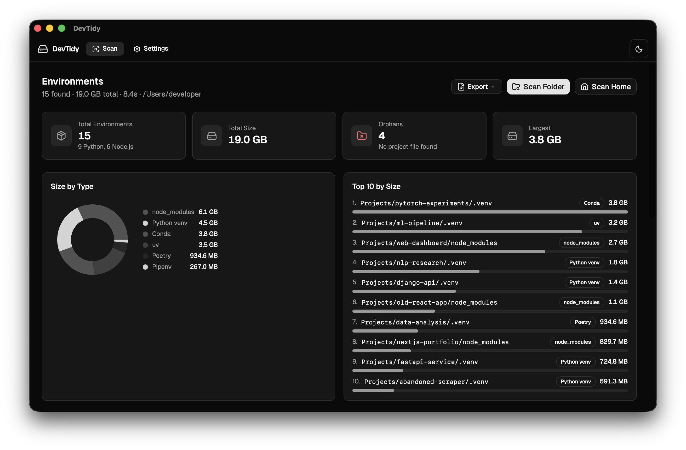

<div align="center">
  <h1>DevTidy</h1>
  <p>Find and clean up Python virtual environments and Node.js <code>node_modules</code> across your entire machine — from a single desktop app.</p>

  <p>
    
    
    
    
  </p>

  <!-- Replace with actual screenshot once available -->
  <!--  -->
</div>

---

## Why DevTidy?

Every developer accumulates dozens of forgotten virtual environments and `node_modules` folders that are invisible and heavy. Hunting them down manually is tedious.

Existing tools only solve half the problem:

| Tool | Type | Covers |
|------|------|--------|
| [npkill](https://github.com/voidcosmos/npkill) ⭐ 9k | CLI | `node_modules` only |
| [pyclean](https://github.com/bittner/pyclean) | CLI | Python bytecode only |
| **DevTidy** | Desktop GUI | Python envs **+** `node_modules` |

DevTidy gives you a single visual dashboard for both ecosystems — scan once, see everything, delete safely.

---

## Features

- **Multi-ecosystem scan** — Python venv, virtualenv, conda, uv, Poetry, Pipenv, pyenv, and Node.js `node_modules`
- **Disk usage at a glance** — size of every environment, sortable and filterable by type or size
- **Dashboard** — stat cards, type distribution chart, and top-10 size ranking
- **Safe deletion** — moves to system trash (recoverable), with a path-depth guard that prevents accidental deletion of system directories
- **Batch operations** — select and delete multiple environments in one action
- **Orphan detection** — flags environments whose parent project no longer has a config file (`package.json`, `requirements.txt`, `pyproject.toml`, etc.)
- **Persistent cache** — SQLite-backed results survive app restarts; open the app, see last scan instantly
- **Configurable** — set scan depth and custom directory exclusion patterns
- **macOS Full Disk Access guidance** — detects missing permissions and opens System Settings in one click
- **Dark / light theme** — follows system preference, or toggle manually

---

## Supported Environment Types

| Type | Detection |
|------|-----------|
| Python `venv` | `pyvenv.cfg` present |
| Python `virtualenv` | `lib/pythonX.Y/site-packages` without `pyvenv.cfg` |
| Conda | `conda-meta/` directory |
| uv | `pyvenv.cfg` with `uv = ` marker |
| Poetry | `pyvenv.cfg` alongside `poetry.lock` |
| Pipenv | `pyvenv.cfg` alongside `Pipfile` |
| pyenv | pyenv version directory structure |
| Node.js `node_modules` | directory named `node_modules` |

---

## Installation

Download the latest release from the [Releases page](../../releases).

### macOS

1. Download `DevTidy_x.x.x_aarch64.dmg` (Apple Silicon) or `_x86_64.dmg` (Intel)
2. Open the `.dmg` and drag **DevTidy** to your Applications folder
3. On first launch, if you see a "Full Disk Access required" banner, click **Open Settings** — the app takes you there directly

### Windows

Download `DevTidy_x.x.x_x64-setup.exe` and run the installer.

### Linux

Download `DevTidy_x.x.x_amd64.deb` (Debian/Ubuntu) or the `.AppImage` for other distributions.

---

## Building from Source

### Prerequisites

- [Rust](https://rustup.rs/) 1.77+
- [Node.js](https://nodejs.org/) 18+
- [pnpm](https://pnpm.io/) 9+
- Platform dependencies from the [Tauri v2 prerequisites guide](https://v2.tauri.app/start/prerequisites/)

**macOS**
```sh
xcode-select --install
```

**Linux (Debian/Ubuntu)**
```sh
sudo apt install libwebkit2gtk-4.1-dev libappindicator3-dev librsvg2-dev patchelf
```

**Windows** — [Microsoft C++ Build Tools](https://visualstudio.microsoft.com/visual-cpp-build-tools/) with "Desktop development with C++"

### Run locally

```sh
git clone https://github.com/ethan-tsai-tsai/devtidy.git
cd devtidy
pnpm install
pnpm tauri dev
```

### Build a production release

```sh
pnpm tauri build
# Output: src-tauri/target/release/bundle/
```

---

## Tech Stack

| Layer | Technology |
|-------|-----------|
| Desktop shell | [Tauri v2](https://v2.tauri.app/) (Rust) |
| Frontend | React 19 + TypeScript |
| UI | [shadcn/ui](https://ui.shadcn.com/) + Tailwind CSS v4 |
| Table | [TanStack Table](https://tanstack.com/table) |
| Charts | [Recharts](https://recharts.org/) |
| Database | SQLite via [rusqlite](https://github.com/rusqlite/rusqlite) |
| File scanning | [jwalk](https://github.com/jessegrosjean/jwalk) (parallel walker) |
| Build | Vite + pnpm |

---

## Project Structure

```
devtidy/
├── src/                        # React frontend
│   ├── components/
│   │   ├── dashboard/          # Stat cards, type chart, size ranking
│   │   ├── env-table/          # Main environment table + dialogs
│   │   └── settings/           # Settings page
│   └── hooks/                  # useScan, useDeleteEnv, useSettings, useTheme
├── src-tauri/                  # Rust backend
│   └── src/
│       ├── commands/           # Tauri IPC commands
│       ├── db/                 # SQLite persistence (cache, settings)
│       └── scanner/            # Walker, detector, sizer
```

---

## Running Tests

```sh
# Frontend
pnpm test

# Rust backend
cd src-tauri && cargo test

# Specific module
cd src-tauri && cargo test scanner::detector::tests
```

---

## Roadmap

- [ ] Auto-update via GitHub Releases
- [ ] Windows and Linux packaging validation
- [ ] Progressive scan (show results as they appear)
- [ ] Table virtualization for very large result sets
- [ ] i18n (English / Traditional Chinese)
- [ ] Smart exclusion rules (system directories, nested `node_modules`)

---

## Contributing

Issues and pull requests are welcome.

1. Fork the repo and create a branch from `develop`: `git checkout -b feature/your-feature`
2. Follow [Conventional Commits](https://www.conventionalcommits.org/) — `feat(scanner): ...`, `fix(ui): ...`
3. Open a PR against `develop`

---

## License

[MIT](LICENSE)
